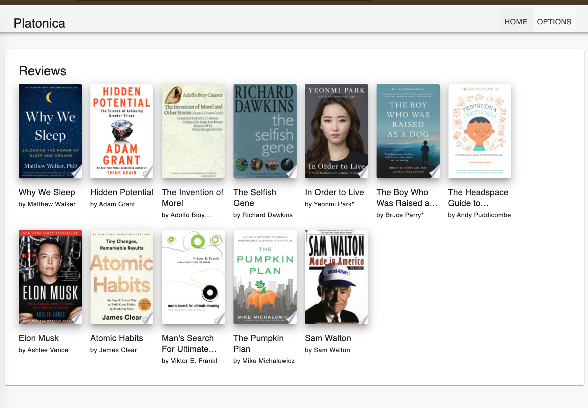

## Platonica

Platonica is an app to share your reviews of a Book but in a more personal/thoughtful way.
Longer summaries, so that you can remember what the book was about. You may add a Goodreads link to the book for more information about it.



### Server

Project uses UV as the package manager.

To install package use `uv add` don't use pip cause it doesn't update toml file.

e.g.

```
uv add django-cors-headers
```

Start UV environment:

```
source .venv/bin/activate
```

To Create and Run migrations:

```
python manage.py makemigrations app
python manage.py migrate app
```

Run Server:

```
python manage.py runserver
```

Admin site available on `http://127.0.0.1:8000/admin`
GraphQL UI available on http://127.0.0.1:8000/app/graphql/

Linter:

```
ruff check . --fix
```

### Web App

Uses React + typescript + tanstack Query

In a separate terminal run:

```
cd web-app/ &&  npm run dev
```

Site available on http://localhost:5173/

### Rebuild database

Needs to run all migrations again. Incudes admin migrations.

Not recommended since you'll delete all your data and doesn't ensure compatibility.

```
python manage.py migrate
python manage.py createsuperuser
```

Define your admin password e.g. `someuser/someuser123`
